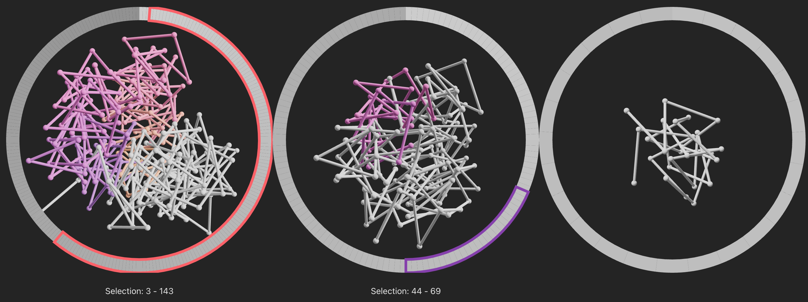

# chromatin-n-out
Prototyping visualization & interaction methods for intuitive hierarchical navigation of 3D data that have a linear component (i.e., 3D chromatin models).

## todo
- [x] rectangular widget mvp
    - [x] single path selection
    - [x] individual levels selections can be edited/redefined (only one selection per level for now)
    - [x] selecting in both directions (0 -> N, N -> 0)
- [x] arc version of the selection widget
    - [x] basic functionality: like the rect version
    - [x] multiple selections: each spawning a new tree
    - [x] fancy colors for selections; base widget should be grayscale gradient
- [x] add 3D model rendering (probably threejs as baseline)
    - [x] include some basic threejs scene
    - [x] connect the shown 3D with selection widgets
    - [x] tube representation
- [x] arc selection widget + 3D view overlaid
    - [x] figure out how to propagate mousedown/up/move events through svg to threlte canvas
- [x] base hiearchical layout
- [ ] non-uniform, interactive and fluid layouting of 3D+widget
    - [ ] physics-based bubbles layout and interaction: zoom in/out triggers enlarging/shrinking which leads to fluid layout change
- [ ] support for larger models
    - [ ] aggregating the selection widget segments
    - [ ] replace Threlte by chromoskein graphics library?
- [ ] switching between base hierarchical prototype and fluid layout (presentation purposes)
- [ ] load chromosomes segmentation
- [ ] load gene annotation

### too small to care
- [x] base arc widget colormap should always go from light gray to dark gray (don't take the slice of colormap because then you can't see the data segments)
- [ ] make random colors more disparate (not getting two similar shades after one another)
- [ ] indicate hovered bin (both on 3D and selection widget)

### kinda big issues
- [ ] 'There are too many active WebGL contexts on this page, the oldest context will be lost.'