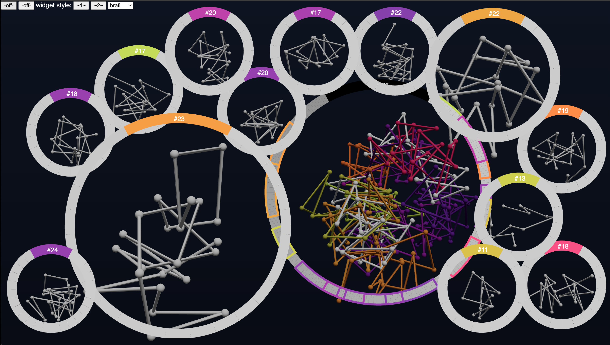

# chromatin-n-out
Work-in-progress: tool for visualization and exploration of spatial chromatin models.

Currently prototyping a visualization & interaction method for intuitive navigation of multiscale 3D data that have a linear organization of its parts. The technique is codenamed "HyperWindows".

## roadmap
- HyperWindows exploration technique MVP
- isolate the 3D data rendering library and host on npm
- expand ecosystem to computational notebooks
